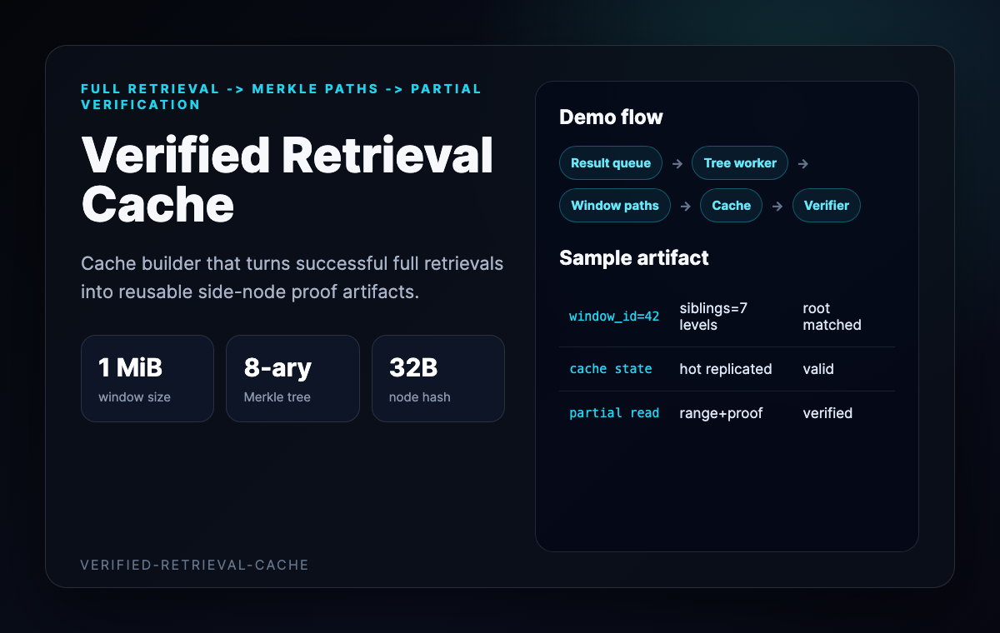
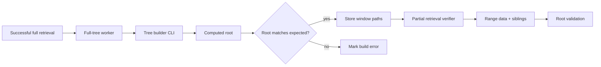
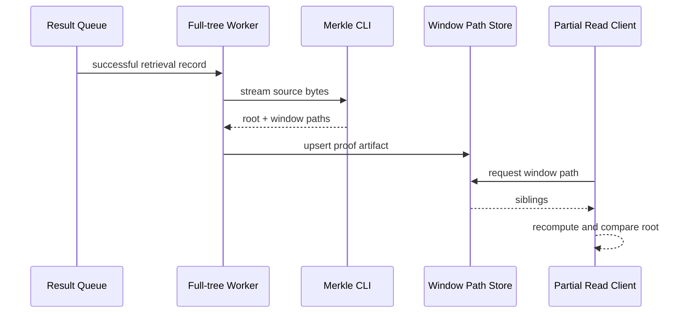
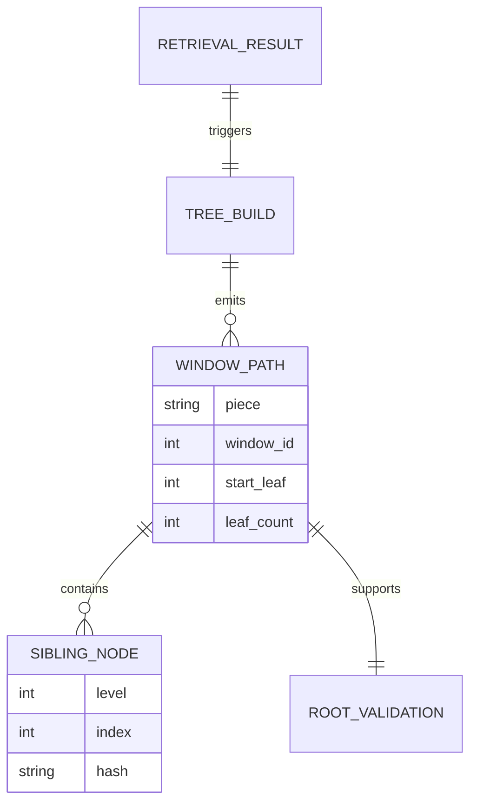

# Verified Retrieval Cache Demo

This walkthrough presents the repo as a validation-first cache builder for
partial retrieval proofs.



## Proof Flow



## Sequence Diagram



## Artifact Entities



## Sample Window-path Artifact

```json
{
  "piece": "baga...",
  "hash_algo": "poseidon-filecoin",
  "arity": 8,
  "window_size_bytes": 1048576,
  "window_paths": [
    {
      "window_id": 42,
      "start_leaf": 1376256,
      "leaf_count": 32768,
      "siblings": [["hex32", "..."], ["hex32", "..."]]
    }
  ],
  "validation": "root_matched"
}
```
